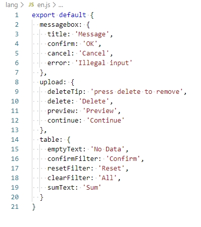

## 说明
使用 Node.js 处理 Excel 格式的多语言文件为 JS 版语言包

## 基础准备
- Node.js 环境
- node-xlsx 依赖包，一个强大的 Excel 文件处理库
- Node.js API
    - fs.writeFile
    - fs.stat
    - fs.mkdir
    - util.inspect

## 测试数据
下面以一个示例文件开始代码编写

这是模拟的多语言 Excel 文件

这是最终生成的 JS 文件

